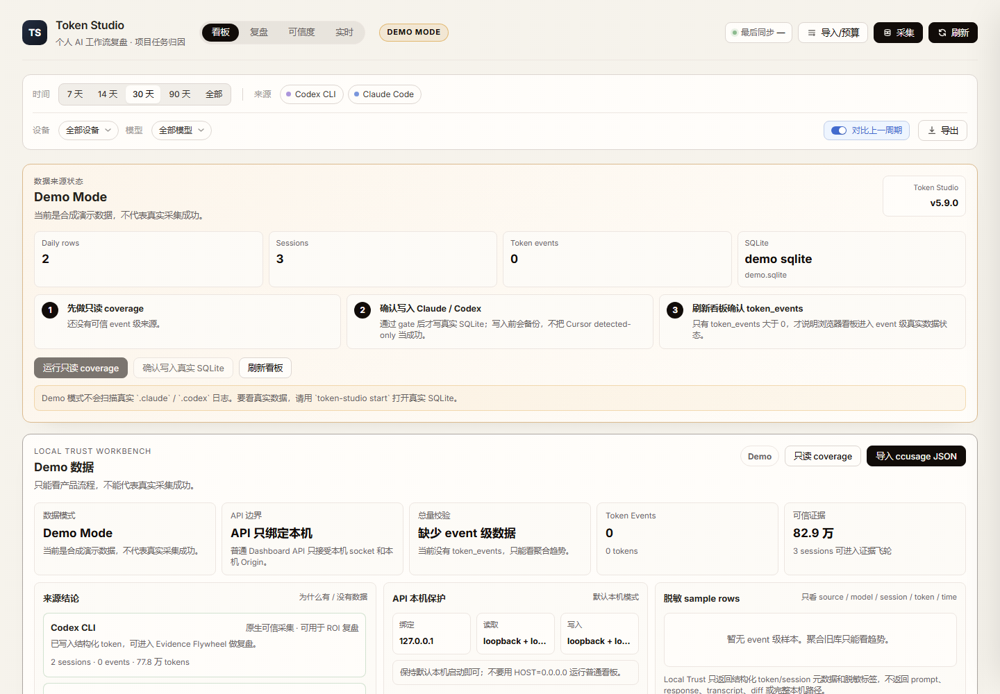
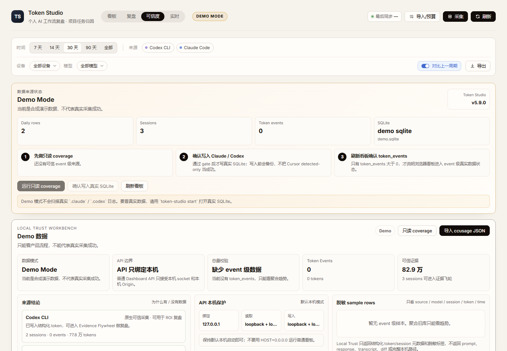
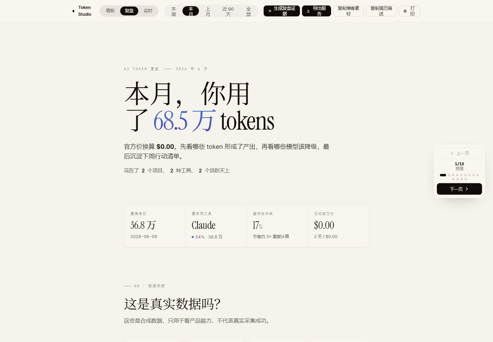
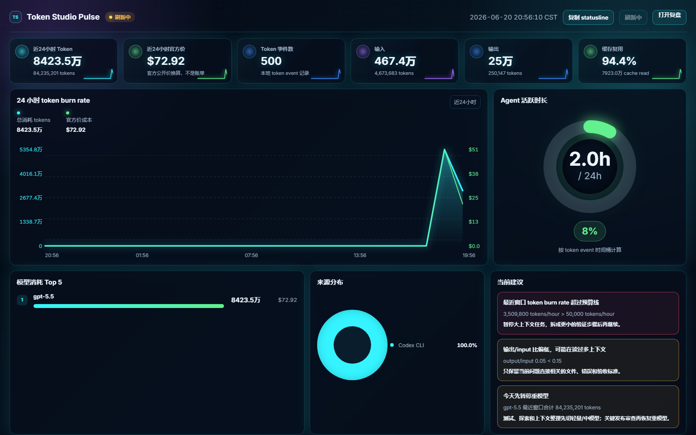

# Token Studio ROI

**English** | [中文](README.md)

**Local AI Coding ROI Studio.** Token Studio ROI is a local, privacy-first AI coding review tool. It does more than count tokens: it connects official-price token usage to projects, tasks, work stages, output evidence, and model strategy.

```bash
npx token-studio
```

The default command runs read-only local coverage, writes trusted Claude/Codex event-level token records into local SQLite, then opens the browser. `demo` is only for synthetic product walkthroughs.

Remember three differences:

- **Work Evidence**: see where tokens went and which project/task/stage/output they belong to.
- **Evidence Autopilot**: turn real tokens into project, task, stage, value, and output-evidence drafts with one action.
- **Savings Simulator**: simulate model-switching savings with official public token prices.

By default it does not read, display, or upload conversation content; it only reads structured token/model/time/session metadata.

## Why Not ccusage / CodeBurn?

| Tool | Strength | Token Studio ROI difference |
|---|---|---|
| ccusage | Broad coverage and mature JSON output | Token Studio ROI uses the bridge for coverage, then focuses on outputs and review |
| CodeBurn | `npx` TUI and local cost observation | Token Studio ROI focuses on weekly reports, action loops, and model policy |
| TokenTracker / CodexBar | Desktop visibility and quota surfaces | Token Studio ROI focuses on local ROI decisions and work evidence |
| tokscale | CLI/TUI, contribution graphs, and leaderboards | Token Studio ROI avoids social display and keeps the local review loop |

See [docs/competitive-notes.md](docs/competitive-notes.md) for the fuller competitor reference and differentiation notes.

v5.9 is the Web/CLI ROI review baseline. v6 adds only two explicit improvements: Coverage Catch-up and the optional Desktop Pulse companion; `v6.0.6` is the live/Pulse stabilization build and does not continue feature expansion. It still avoids leaderboards, cloud sync, accounts, multi-user features, and fake collector coverage. See [docs/final-review.md](docs/final-review.md).

## What Makes ROI Different?

Token Studio focuses on reviewable evidence, not only metering. Coverage Catch-up + Evidence Flywheel make it clear whether data exists, where it came from, and whether it is enough for ROI decisions. v6 adds an optional Desktop Pulse entry without changing the v5 review spine; publishing requires the local gate, GitHub release gate, tarball smoke, and npm post-publish smoke.

- **Coverage Catch-up Center**: separates sources into native trusted collection, ccusage importable, experimental audit, detected-only, and unsupported/no-token-field states so directory detection is not mistaken for real usage coverage.
- **Coverage Bridge Workflow**: each source shows successful coverage, failure reasons, importable reports, and copy-only commands; the browser generates commands but never runs external scanners.
- **Local Trust Workbench**: shows data mode, coverage gate, daily/session/event reconciliation, source failure reasons, and sanitized sample rows before making ROI claims.
- **Evidence Flywheel**: connects real tokens, project identification, automatic evidence, confirmation drafts, output links, and model-strategy samples on `/review`.
- **Trust-to-Evidence Autopilot**: on the Dashboard and `/trust`, turns trusted-source sessions into the top 10 evidence gaps by official-price cost and token volume, separating direct-write suggestions from confirmation drafts.
- **Evidence Quality Loop**: separates evidence into direct-write, confirmation draft, blocked, and manual-confirmed tiers; Savings Simulator and Model Strategy label evidence provenance.
- **Evidence Autopilot**: on `/review`, generate high-confidence attribution, project aliases, output candidates, and model-strategy samples without calling an LLM, reading content, or overwriting manual labels.
- **Git metadata output candidates**: reads only repo name, remote host, commit hash, and commit time; output links are written only when an HTTPS commit URL can be generated, with no diff or file-content reads.
- **ROI Savings Simulator**: compares official-price model switching scenarios for exploration, testing, context prep, low-value, and abandoned work.
- **ccusage JSON Import**: imports documented ccusage JSON output for broader structured usage coverage while recomputing costs with Token Studio official pricing.
- **ccusage CLI Bridge UX**: the Dashboard only generates copyable local commands; the browser never runs external scanners.
- **ccusage post-import flow**: after applying ccusage JSON, `/trust` shows source/project/model/session coverage changes and evidence gaps.
- **Source Health / Coverage Bridge**: shows native stable, experimental, detected-only, and ccusage import-bridge status, recent usage, token-field trust, recommended import path, and privacy boundaries without exposing full local paths.
- **Collection Coverage Gate**: run `token-studio coverage` before real import/apply to verify whether Claude/Codex have event-level history and whether Cursor is only detected without reliable token fields.
- **Import / Budget Wizard**: paste or upload ccusage JSON in the Dashboard, dry-run first, inspect shape/session/event counts, unsafe fields, and unpriced models, then explicitly apply to SQLite.
- **Quota Profiles v2**: supports rolling/fixed custom guardrail windows, reset anchors, warning thresholds, burn projection, reset countdown, and near/over/exceeded warnings on `/live`.
- **Quota Profiles v3**: budget windows can filter by source and model group, with warning and hard thresholds; these remain user-defined guardrails, not provider subscription quotas.
- **Desktop Pulse Companion**: optional Electron tray/window entry that reuses local `/live`, `/trust`, and `/review`; it does not duplicate collectors, but it asks the local service to refresh trusted Claude/Codex structured token metadata under the same safety rules and never uploads data.
- **Cyberpunk Live / Pulse UI**: the cyberpunk look is used for browser `/live` and Electron Desktop Pulse; Dashboard, Trust, and Review keep the calmer Claude-like review/audit UI.
- **Statusline Guardrails**: `token-studio statusline` prints recent-window tokens, burn rate, cache, budget usage, unpriced-model warnings, and open actions for terminal prompts, tmux, or Claude Code statusline.
- **ROI Playbook Export**: `token-studio policy` exports Markdown, Claude Code, or AGENTS-style model-use snippets without editing project files.
- **Advisor Action Loop**: turns Savings Simulator and ROI Advisor recommendations into open/done/dismissed actions and includes them in weekly Markdown reports.
- **Advisor Action Measurement**: compares same-scope before/after token and official-price trends for review actions, without claiming causal savings.
- **Review Report v3**: adds Local Trust, Coverage-to-Evidence, Action trend, GitHub README positioning, and blog-case-study material to Markdown weekly reports.
- **Final Review**: `docs/final-review.md` locks the product boundary, acceptance checklist, and stop rules to avoid endless low-return iteration.
- **Collector Audit**: audits experimental collectors before upgrading support, without SQLite writes or full-path output.
- **Work Evidence**: connects usage to projects, tasks, stages, value, output links, and work items.

All dollar values are official-price conversions or simulations, not provider invoices.

## Quick Start

Recommended Node.js: 24. Minimum: `>=22.12.0`.

```bash
npx token-studio
```

Expected output:

```text
[token-studio] coverage claude,codex,cursor (read-only)
[token-studio] collect applied: sessions +..., token_events +...
[token-studio] UI  http://127.0.0.1:5173/
[token-studio] API http://127.0.0.1:4173
```

Common commands:

```bash
npx token-studio
npx token-studio --no-collect
npx token-studio --dry-run-only
npx token-studio demo
npx token-studio start
npx token-studio coverage --sources=claude,codex,cursor --json
npx token-studio collect --dry-run --sources=claude,codex,cursor --json
npx token-studio collect --apply --yes --sources=claude,codex
npx token-studio import-usage --format=ccusage-cli --report=session --dry-run --yes
npx token-studio statusline --format=text
npx token-studio collectors
npx token-studio privacy-check
```

From source:

```bash
git clone https://github.com/RyanCoreAI/token-studio-roi.git
cd token-studio-roi
npm install
node src/cli.mjs
npm run desktop
```

### Local Browser App vs Desktop App

| Entry | Best for | What it does | Status |
|---|---|---|---|
| `npx token-studio` / `node src/cli.mjs` | Most users | Runs read-only coverage and trusted Claude/Codex apply before startup, then refreshes trusted event-level token metadata every 60 seconds while the local service is running | Primary entry |
| `npx token-studio demo` | First product walkthrough | Starts synthetic demo data only; it does not prove real collection worked | Demo entry |
| `npm run desktop` | Local users who want a tray/window pulse | Starts or reuses the local service, opens a compact Desktop Pulse window, and enables 60-second trusted Claude/Codex metadata refresh when it starts the service | Optional MVP |

The desktop app is not meant to replace the browser workspace. Full review, evidence queues, imports, and reports still belong in the Web App. Desktop Pulse is only for the “I do not want a browser tab open, but I want to know whether today’s token usage is getting out of control” use case. Browser `/live` and Desktop Pulse now share the same dark Pulse dashboard. Pulse does not read process memory; it refreshes local logs into SQLite and then reads the recent window, so a 5-60 second delay is normal. It is not yet a one-click packaged desktop installer in the npm distribution; a public desktop release should be shipped later as GitHub Release assets after desktop smoke and privacy checks.

`npx token-studio` scans structured token metadata from local `.claude`, `.codex`, and Cursor locations; it automatically writes only trusted Claude/Codex event-level records, while Cursor without explicit token fields stays detected/no-token-fields. The default real entry keeps refreshing trusted Claude/Codex event-level metadata every 60 seconds; `TOKEN_STUDIO_LIVE_COLLECT_INTERVAL_SECONDS` can override the interval with a 30-second minimum. `start`, `--no-collect`, `--dry-run-only`, and `demo` do not run the background refresh. The default DB path is `data/usage.sqlite` under the command's working directory; use `--db` or `DB_PATH` to choose another location. The Dashboard shows a data-source status: Demo Mode, Empty DB, Real DB - aggregate only, Real DB - event data needs coverage, or Real DB - event verified. `event verified` requires token events plus a passed coverage gate or a verifiable collect run. The `ccusage-cli` bridge explicitly runs the external ccusage local scanner; Token Studio only accepts structured JSON, rejects conversation-like fields, and ignores third-party cost fields.

See [docs/first-run.md](docs/first-run.md) for the first-run flow. The Dashboard also derives first-run guidance from the current database: no data points to demo/import, data without actions points to `/review`, and budgets without event-level live data explain the `/live` window behavior.

## Screenshots

These screenshots are from demo mode or sanitized synthetic data, not real local logs.









Real local validation screenshots are for pre-release verification, not the default public hero assets. They may contain model names, project aliases, and aggregate token counts, but must not contain prompts, responses, transcripts, diffs, full local paths, or private exported reports.

- [Real Dashboard with charts](docs/assets/token-studio-v591-real-dashboard.png)
- [Real Local Trust](docs/assets/token-studio-v591-real-trust.png)
- [Real Review](docs/assets/token-studio-v591-real-review.png)
- [Real Live](docs/assets/token-studio-v591-real-live.png)

Advanced troubleshooting commands:

```bash
npx token-studio coverage --sources=claude,codex,cursor --json
npx token-studio collect --dry-run --sources=claude,codex,cursor
npx token-studio collect --apply --yes --sources=claude,codex
npx token-studio compare-ccusage --report=session --json --yes
```

`coverage` and `--dry-run` report candidate files, parseable token records, skip reasons, historical time range, and daily/session/event token reconciliation without writing SQLite. `--apply` creates a SQLite backup before writing; if Claude/Codex have parseable token records but would write zero `token_events`, or if daily/session/event totals differ by more than 1%, the coverage gate blocks the apply. Cursor writes usage only when local `state.vscdb` exposes explicit token fields; otherwise it reports “detected but no reliable token fields” and never estimates usage.

Token Studio cannot promise to reconstruct every historical token. It can only cover local history that still exists on disk and contains reliable structured token fields; data deleted upstream or never recorded with token fields cannot be recovered.

## Core Features

- Collector registry: Claude Code, Codex CLI, Gemini CLI, OpenCode, OpenClaw, and Hermes Agent are v4.0 stable sources.
- Experimental sources: Cursor, GitHub Copilot CLI, Qwen Code, Kimi, and Goose import only explicit token fields and never produce fake token rows.
- Official-price conversion: published provider token prices only; unpriced models stay unpriced.
- Work attribution: project, task type, output status, purpose, stage, value, and notes.
- Output evidence: stores only URL, label, and output type.
- ROI Evidence Score: checks whether attribution, outputs, manual confirmation, and work items are strong enough for ROI decisions.
- ROI Savings Simulator: simulates model switching savings with official prices and keeps unpriced models out of dollar decisions.
- ROI Advisor: local rules only, no LLM calls and no extra token usage.
- Advisor Action Loop: add recommendations to an action list, mark them done or dismissed, and review trends without claiming causal savings.
- Model Policy / ROI Playbook export: generates Markdown, Claude Code, or AGENTS-style strategy snippets from local structured history without writing files.
- ccusage Import Bridge: `token-studio import-usage --format=ccusage-json` imports saved structured JSON, and `--format=ccusage-cli` explicitly invokes ccusage CLI; both avoid conversation content and third-party cost estimates.
- Source Health Center: the Dashboard and `/api/source-health` show support tier, detected status, recent import/collection summary, and token-field trust without leaking full local paths.
- Local Trust Workbench: the Dashboard and `/api/local-trust` show data trust, coverage gate, daily/session/event reconciliation, source failure reasons, and sanitized sample rows.
- Trust UX: `/trust` focuses on data trust, local API boundary, remote ingest state, Coverage Bridge, and source failure reasons before making strong ROI claims.
- Collection Coverage Gate: `token-studio coverage`, `GET /api/collection-coverage`, and the Dashboard collection-trust card show historical range, event/session/daily reconciliation, uncovered sources, and failure reasons.
- Import / Budget Wizard: dashboard entry for ccusage JSON dry-run/apply, ccusage CLI Bridge command generation, and budget-window creation.
- Quota Profiles v2: source-level custom token/cost guardrails with rolling/fixed windows, reset anchors, warning thresholds, and near/over/exceeded warnings.
- Live Monitor: `/live` shows recent 15-minute token, model, cache, burn-rate metadata, budget windows, and guardrail warnings.
- Statusline Guardrails: `token-studio statusline --format=text|json` reads SQLite only and prints recent-window tokens, burn rate, cache, budget usage, reset countdown, unpriced-model warnings, and open Advisor Actions; integration examples are in [docs/statusline.md](docs/statusline.md).
- Collector Audit: `token-studio collectors --audit` returns a safe experimental-source summary without writing SQLite.
- Terminal Report: `token-studio report --period=week --format=table|markdown|json` prints a quick ROI review summary.
- Privacy check: scans for real DBs, AI log directories, `.env`, generated exports, personal paths, and likely secrets.
- Demo mode: public demos use synthetic data and show a Demo Mode badge.
- First-run onboarding: empty-data, import, budget, and review-action guidance without cloud sync or accounts.

## Why Not Just ccusage / CodeBurn?

ccusage, CodeBurn, TokenTracker, and token-dashboard are closer to token meters, TUIs, live burn-rate monitors, or broad collector dashboards. Token Studio ROI is not trying to replace those tools. It turns local token usage into reviewable work evidence: projects, tasks, purpose, stage, value, output links, work items, ROI Evidence, Advisor actions, and Model Policy.

If you only need to know how many tokens you used today, ccusage or CodeBurn may be lighter. If you want to understand what those tokens produced and how to change next week's model strategy, Token Studio ROI is the better fit.

## Privacy Boundary

Token Studio ROI does not store:

- prompts
- responses
- full transcripts
- full file paths
- command bodies
- diff content

Fine-grained analysis may store only token structure, source, model, timestamp, tool category, file extension, repo path hash, and privacy level.

Run the publish gate:

```bash
npm run privacy:check
```

## API

Stable interfaces:

- `GET /api/data`
- `GET /api/collectors`
- `GET /api/source-health`
- `GET /api/live`
- `GET /api/budget-profiles`
- `POST /api/budget-profiles`
- `DELETE /api/budget-profiles`
- `POST /api/import/ccusage-json`
- `GET /api/advisor-actions`
- `POST /api/advisor-actions`
- `DELETE /api/advisor-actions/:id`
- `GET /api/privacy-check`
- `GET /api/model-policy.md`
- `POST /api/collect`
- `POST /api/session-annotations`
- `POST /api/session-annotations/batch`
- `POST /api/session-outputs`
- `GET /api/auto-attribution/suggestions`
- `POST /api/auto-attribution/apply`
- `POST /api/auto-attribution/undo`
- `POST /api/work-items`
- `POST /api/work-items/link-sessions`
- `DELETE /api/work-items/:id`

All non-public `/api/*` read APIs also require loopback requests and local Origin. Normal write APIs remain loopback-only, local-Origin-only, and JSON-only. `/api/ingest` is disabled by default and only accepts JSON machine writes when `INGEST_TOKEN` is set and the request sends `Authorization: Bearer <token>`. The server does not trust `X-Forwarded-For` for local access checks. By default the server binds only to `127.0.0.1`; `HOST=0.0.0.0` or any other non-loopback bind is refused unless `TOKEN_STUDIO_ALLOW_REMOTE=1` and `INGEST_TOKEN` are both set. That remote mode is reserved for explicit ingest scenarios and does not turn ordinary Dashboard APIs into remotely accessible APIs.

## Development

```bash
npm install
npm test
npm run build
npm run privacy:check
```

Development mode:

```bash
npm run dev
```

Default URLs:

- UI: `http://127.0.0.1:5173`
- API: `http://127.0.0.1:4173`

## Public Readiness Checklist

- [ ] `npm test`
- [ ] `npm run build`
- [ ] `npm run privacy:check`
- [ ] `node src/cli.mjs privacy-check --include-untracked`
- [ ] `node src/cli.mjs coverage --sources=claude,codex,cursor --json`
- [ ] `npm run smoke:npx`
- [ ] `npm run smoke:browser`
- [ ] `npm run desktop:smoke`
- [ ] `npm audit --audit-level=low`
- [ ] `npm view token-studio version` is lower than this package version before publishing
- [ ] `npm pack --dry-run`
- [ ] `npm run smoke:published -- --version 6.0.6` after npm publish
- [ ] demo screenshots come from demo mode
- [ ] real validation screenshots are inspected and contain no transcript, diff, prompt, full path, or private export
- [ ] `/live` loads from demo mode or temporary SQLite
- [ ] Desktop Pulse uses only local `127.0.0.1` URLs and passes Electron security smoke
- [ ] no real `data/usage.sqlite`
- [ ] no `.claude/`, `.codex/`, `.env`
- [ ] no raw conversation content
- [ ] README says official-price conversion is not a provider invoice
- [ ] NOTICE preserves attribution for the MIT prototype

## License / Attribution

MIT licensed. See [LICENSE](LICENSE) and [NOTICE.md](NOTICE.md).

Token Studio ROI is a standalone public packaging and productization effort by ryan. It preserves attribution for the earlier MIT prototype while making the public product, CLI, collector registry, privacy scanner, ROI evidence layer, work item model, advisor, and model policy workflow first-class Token Studio ROI features.
