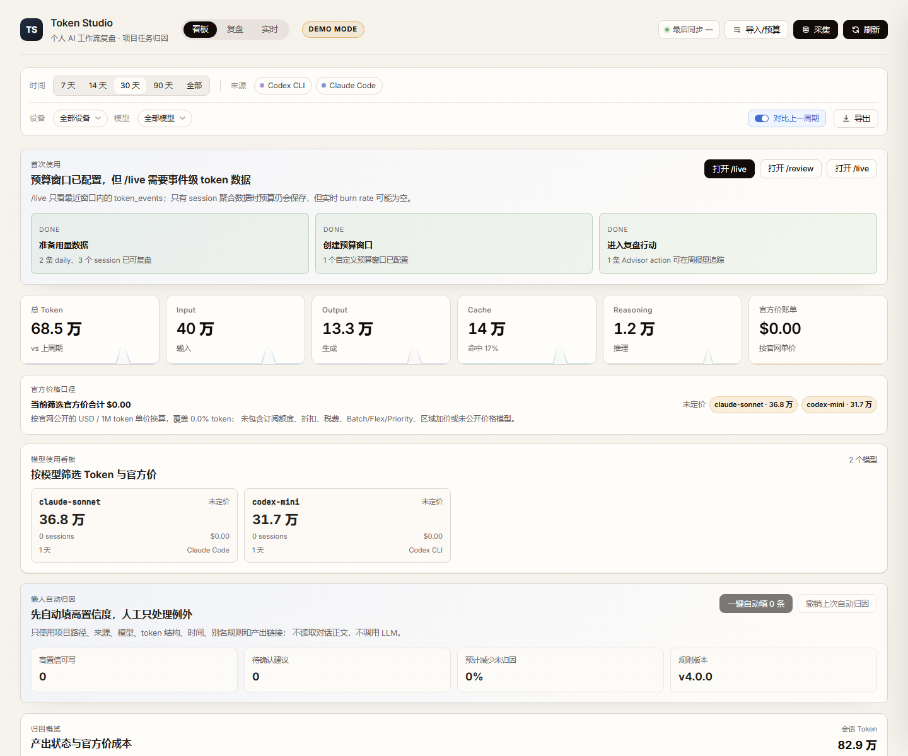
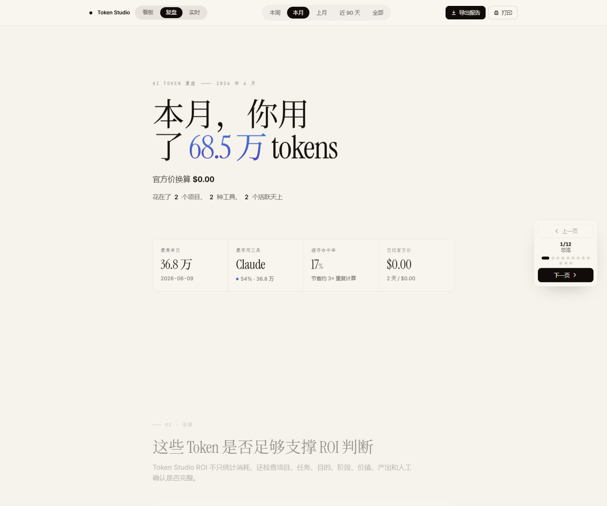
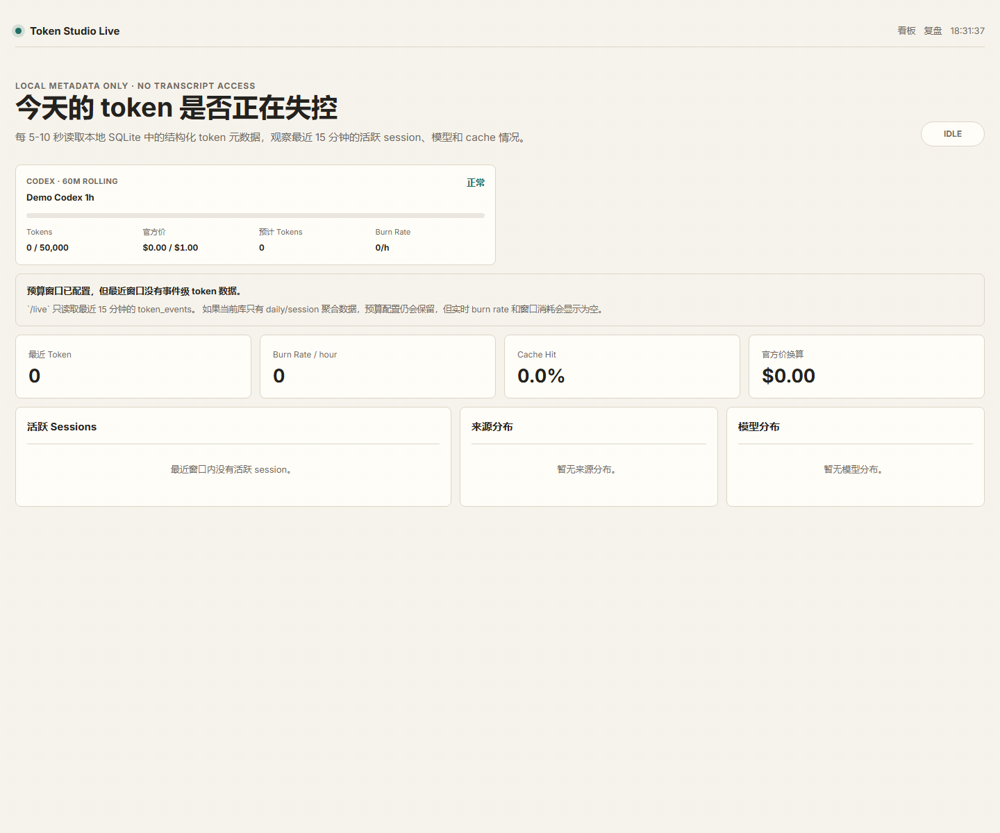

# Token Studio ROI

[English](README.en.md) | **中文**

**Local AI Coding ROI Studio.** Token Studio ROI 不只是 token meter，而是一个本地隐私优先的 AI 编程复盘工具：记录 token 和官方价换算成本，连接项目、任务、工作阶段、产出证据和模型策略。

```bash
npx token-studio
```

默认命令会先做本机只读 coverage，再把 Claude/Codex 的可信 event 级 token 记录写入本地 SQLite，最后打开浏览器。`demo` 只用于合成演示数据。

首屏只需要记住三个差异：

- **Work Evidence**：回答 token 花在哪、对应什么项目/任务/阶段/产出。
- **Savings Simulator**：按官方公开 token 价格模拟模型切换后的节省空间。
- **Model Policy**：把历史用量转成下周轻量/中等/重模型使用策略。

默认不读取、不展示、不上传对话正文；只读取结构化 token/model/time/session 元数据。

## Why Not ccusage / CodeBurn?

| 工具 | 强项 | Token Studio ROI 的差异 |
|---|---|---|
| ccusage | 覆盖广、JSON 输出成熟 | Token Studio ROI 用 ccusage bridge 补覆盖，但重点做产出和复盘 |
| CodeBurn | `npx` TUI 和本地成本观测 | Token Studio ROI 做周报、行动闭环和模型策略 |
| TokenTracker / CodexBar | 桌面组件、限额可见性 | Token Studio ROI 做本地 ROI 决策和工作证据 |

更完整的竞品参考和差异化记录见 [docs/competitive-notes.md](docs/competitive-notes.md)。

## What Makes ROI Different?

Token Studio ROI 的 v4.8 重点不是再堆一个 token meter，而是把统计结果转成可执行决策，并用 npm 一键启动、Source Health、CLI bridge、quota profiles 和 statusline integration 补齐竞品的覆盖面和实时入口：

- **ROI Savings Simulator**：模拟“探索、测试、上下文整理、低价值或废弃任务从重模型切到轻量/中模型”时，按官方公开 token 价格可能少花多少。
- **ccusage JSON Import**：兼容 ccusage documented JSON output，借它的多源生态导入结构化 token 数据，但成本仍由 Token Studio 官方价函数重算。
- **ccusage CLI Bridge UX**：Dashboard 只生成可复制命令，不从浏览器运行外部扫描器；真实 bridge 仍由用户在本地终端显式执行。
- **Source Health Center**：显示 native stable、experimental、detected-only、ccusage import-bridge 的状态、最近用量、token 字段可信度和隐私边界，不输出完整本机路径。
- **Collection Coverage Gate**：真实采集前先跑 `token-studio coverage`，确认 Claude/Codex 是否有 event 级历史、Cursor 是否只有 detected-only，避免把目录检测误认为采集成功。
- **Import / Budget Wizard**：在 Dashboard 里粘贴或上传 ccusage JSON，先 dry-run 看 shape、session/event 数、unsafe 字段和未定价模型，确认后才写 SQLite。
- **Quota Profiles v2**：支持 rolling/fixed 自定义限额窗口、reset anchor、warning threshold，在 `/live` 看到 burn projection、reset countdown 和 near/over/exceeded warnings。
- **Statusline Guardrails**：`token-studio statusline` 输出最近窗口 token、burn rate、cache、预算使用率、未定价模型提示和 open actions，适配终端 prompt、tmux 或 Claude Code statusline。
- **ROI Playbook Export**：`token-studio policy` 导出 Markdown、Claude Code 或 AGENTS 风格模型使用策略片段，不自动修改项目文件。
- **Advisor Action Loop**：把 Savings Simulator / ROI Advisor 建议加入行动清单，标记完成或忽略，并写入 Markdown 周报。
- **Collector Audit**：先审计 experimental collector 是否真的有可靠 token 字段，再决定是否升级支持级别，不用估算值伪造用量。
- **Work Evidence**：把 session 连接到项目、任务、阶段、价值、产出链接和 work item，回答“token 换来了什么”。

所有 ROI 金额都写作“官方价换算 / 节省模拟”，不能当供应商账单或财务对账。

## Quick Start

推荐 Node.js 24，最低 Node.js `>=22.12.0`。

```bash
npx token-studio
```

预期输出类似：

```text
[token-studio] coverage claude,codex,cursor (read-only)
[token-studio] collect applied: sessions +..., token_events +...
[token-studio] UI  http://127.0.0.1:5173/
[token-studio] API http://127.0.0.1:4173
```

常用命令：

```bash
npx token-studio
npx token-studio --no-collect
npx token-studio --dry-run-only
npx token-studio demo
npx token-studio start
npx token-studio coverage --sources=claude,codex,cursor --json
npx token-studio collect --dry-run --sources=claude,codex,cursor --json
npx token-studio collect --apply --yes --sources=claude,codex
npx token-studio import-usage --format=ccusage-cli --report=session --dry-run --yes
npx token-studio statusline --format=text
npx token-studio collectors
npx token-studio privacy-check
```

从源码运行：

```bash
git clone https://github.com/RyanCoreAI/token-studio-roi.git
cd token-studio-roi
npm install
node src/cli.mjs
```

`npx token-studio` 会扫描本机 `.claude`、`.codex` 和 Cursor 的结构化 token 元数据；只会自动写入 Claude/Codex 的可信 event 级记录，Cursor 没有明确 token 字段时只显示 detected/no-token-fields。`--no-collect` 只启动已有 SQLite，`--dry-run-only` 只做 coverage 不写库，`demo` 使用合成数据。默认 DB 路径是当前运行目录的 `data/usage.sqlite`；可用 `--db` 或 `DB_PATH` 指定位置。Dashboard 会显示“数据来源状态”：Demo Mode、Empty DB、Real DB - aggregate only、Real DB - event data needs coverage 或 Real DB - event verified。`event verified` 需要 token events 加上通过的 coverage gate 或可验证的 collect run。`ccusage-cli` bridge 会显式运行外部 ccusage 本地扫描器；Token Studio 只接收结构化 JSON，拒绝 conversation-like 字段，并忽略第三方 cost 字段。

首次使用流程见 [docs/first-run.md](docs/first-run.md)。Dashboard 也会根据当前数据状态显示“首次使用”引导：无数据时提示 demo/import，有数据但无 action 时提示去 `/review`，有预算但无事件级 live 数据时解释 `/live` 的窗口口径。

## Screenshots

这些截图来自 demo mode 或脱敏合成数据，不包含真实本机日志。







高级排错命令：

```bash
npx token-studio coverage --sources=claude,codex,cursor --json
npx token-studio collect --dry-run --sources=claude,codex,cursor
npx token-studio collect --apply --yes --sources=claude,codex
npx token-studio compare-ccusage --report=session --json --yes
```

`coverage` 和 `--dry-run` 都只输出候选文件数、可解析 token 记录数、跳过原因、历史时间范围以及 daily/session/event token 合计，不写 SQLite。`--apply` 写入前会备份 SQLite；如果 Claude/Codex 有可解析 token 记录但将写入的 `token_events` 为 0，或者 daily/session/event 总量差异超过 1%，会被 coverage gate 阻止。Cursor 只有本地 `state.vscdb` 里存在明确 token 字段时才写入用量，否则显示“检测到但无可靠 token 字段”，不估算造数。

Token Studio 不能承诺恢复所有历史。它只能覆盖本机仍保留、且日志里有可靠 token 字段的历史；已被上游清理或从未记录 token 字段的数据无法复原。

## Core Features

- Collector registry：Claude Code、Codex CLI、Gemini CLI、OpenCode、OpenClaw、Hermes Agent 作为 v4.0 stable 来源。
- Experimental sources：Cursor、GitHub Copilot CLI、Qwen Code、Kimi、Goose 仅在存在明确 token 字段时导入，不伪造 token 或费用。
- Official-price conversion：按官方公开 token 单价换算，未公开美元价的模型保持未定价。
- Work attribution：项目、任务类型、产出状态、工作目的、阶段、价值、备注。
- Output evidence：只保存 URL、标签和类型，不抓取链接内容。
- ROI Evidence Score：检查归因、产出、人工确认和 work item 是否足够支撑 ROI 判断。
- ROI Savings Simulator：按官方价模拟模型切换后的节省空间，不把未定价模型算作 $0。
- ROI Advisor：本地规则建议，不调用 LLM，不额外消耗 token。
- Advisor Action Loop：把建议加入行动清单、标为完成或忽略；只做趋势复盘，不声称因果节省。
- Model Policy / ROI Playbook：导出 Markdown、Claude Code 或 AGENTS 风格策略片段，把历史用量转成下周模型使用策略，不自动写文件。
- ccusage Import Bridge：`token-studio import-usage --format=ccusage-json` 导入保存的结构化 JSON，`--format=ccusage-cli` 显式调用 ccusage CLI；两者都不保存正文，不采用第三方估算成本。
- Source Health Center：Dashboard 和 `/api/source-health` 展示来源支持级别、检测状态、最近导入/采集摘要和 token 字段可信度，不泄露完整本机路径。
- Collection Coverage Gate：`token-studio coverage`、`GET /api/collection-coverage` 和 Dashboard “真实采集可信度”卡片展示历史范围、event/session/daily 一致性、未覆盖来源和失败原因。
- Import / Budget Wizard：Dashboard 内置 ccusage JSON dry-run/apply、ccusage CLI Bridge 命令生成器和预算窗口创建入口。
- Quota Profiles v2：自定义 source 级 token/cost 预算窗口，支持 rolling/fixed、reset anchor 和 warning threshold，`/live` 显示 near/over/exceeded warnings。
- Live Monitor：`/live` 轻量监控最近 15 分钟 token、模型、cache、burn rate、预算窗口和 guardrail warnings。
- Statusline Guardrails：`token-studio statusline --format=text|json` 只读 SQLite，输出最近窗口 token、burn rate、cache、预算使用率、reset countdown、未定价模型提示和 open Advisor Actions；集成示例见 [docs/statusline.md](docs/statusline.md)。
- Collector Audit：`token-studio collectors --audit` 只输出实验来源安全摘要，不写 SQLite。
- Terminal Report：`token-studio report --period=week --format=table|markdown|json` 快速查看 ROI 复盘摘要。
- Privacy check：公开前扫描真实 DB、AI 日志目录、`.env`、导出文件和个人路径。
- Demo mode：公开演示默认使用合成数据并显示 Demo Mode 标识。
- First-run onboarding：空数据、导入、预算、复盘 action 的首次使用引导，不新增云同步或账号。

## Why Not Just ccusage / CodeBurn?

ccusage、CodeBurn、TokenTracker 和 token-dashboard 更偏 token meter、TUI、实时 burn rate 或工具覆盖。Token Studio ROI 的核心不是替代这些统计器，而是把本地 token 消耗变成可复盘的工作证据：项目、任务、目的、阶段、价值、产出链接、work item、ROI Evidence、Advisor 行动项和 Model Policy。

如果你只想知道今天用了多少 token，ccusage 或 CodeBurn 会更轻。如果你想知道这些 token 换来了什么产出、下周该怎么换模型策略，Token Studio ROI 更适合。

## Privacy Boundary

Token Studio ROI 不保存：

- prompt
- response
- full transcript
- full file path
- command body
- diff content

细粒度分析只允许保存 token 结构、来源、模型、时间、tool category、文件扩展名、repo path hash 和 privacy level。

运行公开检查：

```bash
npm run privacy:check
```

## API

稳定接口：

- `GET /api/data`
- `GET /api/collectors`
- `GET /api/source-health`
- `GET /api/live`
- `GET /api/budget-profiles`
- `POST /api/budget-profiles`
- `DELETE /api/budget-profiles`
- `POST /api/import/ccusage-json`
- `GET /api/advisor-actions`
- `POST /api/advisor-actions`
- `DELETE /api/advisor-actions/:id`
- `GET /api/privacy-check`
- `GET /api/model-policy.md`
- `POST /api/collect`
- `POST /api/session-annotations`
- `POST /api/session-annotations/batch`
- `POST /api/session-outputs`
- `GET /api/auto-attribution/suggestions`
- `POST /api/auto-attribution/apply`
- `POST /api/auto-attribution/undo`
- `POST /api/work-items`
- `POST /api/work-items/link-sessions`
- `DELETE /api/work-items/:id`

所有写接口继续限制为 loopback、local Origin、JSON。服务端不信任 `X-Forwarded-For` 作为本机判断。

## Development

```bash
npm install
npm test
npm run build
npm run privacy:check
```

开发模式：

```bash
npm run dev
```

默认地址：

- UI: `http://127.0.0.1:5173`
- API: `http://127.0.0.1:4173`

## Public Readiness Checklist

- [ ] `npm test`
- [ ] `npm run build`
- [ ] `npm run privacy:check`
- [ ] `node src/cli.mjs coverage --sources=claude,codex,cursor --json`
- [ ] `npm view token-studio version` is lower than this package version before publishing
- [ ] `npm pack --dry-run`
- [ ] demo screenshots come from demo mode
- [ ] `/live` loads from demo mode or temporary SQLite
- [ ] no real `data/usage.sqlite`
- [ ] no `.claude/`, `.codex/`, `.env`
- [ ] no raw conversation content
- [ ] README explains official-price conversion is not a provider invoice
- [ ] NOTICE keeps attribution for the MIT prototype

## License / Attribution

MIT licensed. See [LICENSE](LICENSE) and [NOTICE.md](NOTICE.md).

Token Studio ROI is a standalone public packaging and productization effort by ryan. It preserves attribution for the earlier MIT prototype while making the public product, CLI, collector registry, privacy scanner, ROI evidence layer, work item model, advisor, and model policy workflow first-class Token Studio ROI features.
